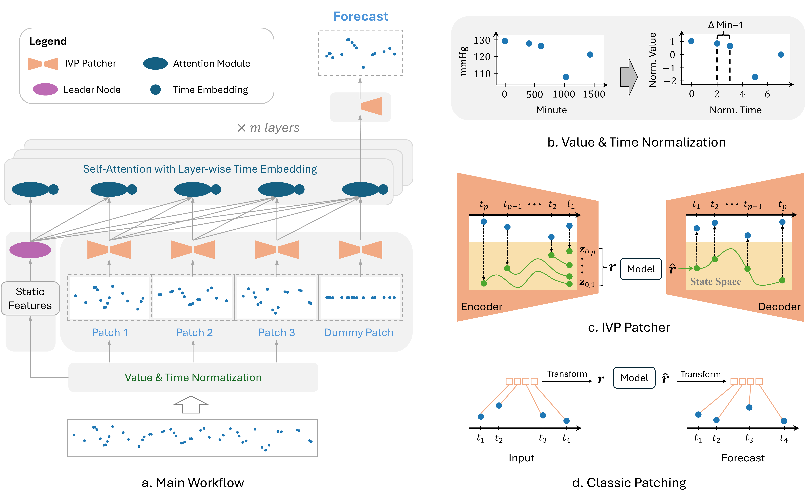

# FlexTSF: A Universal Forecasting Model for Time Series with Variable Regularities

## Overview

This is the official PyTorch implementation of the paper **FlexTSF: A Universal Forecasting Model for Time Series with Variable Regularities**.

This repository provides the source code implementation for:

- [**FlexTSF model**](./models/flextsf.py)
- [**Data preprocessing**](#2-datasets)
- [**Classic training**](#31-classic-training)
- [**Pre-training**](#32-pre-training)
- [**Zero-shot**](#33-zero-shot)
- [**Few-shot**](#34-few-shot)

Developing a foundation model for time series forecasting presents significant challenges due to the diverse characteristics of time series data. First, time series data contain a wide range of measurement types, such as systolic blood pressure, exchange rate, and electricity consumption, each demonstrating different scales (e.g., 1-10, 50-150) and temporal granularities (e.g., minutes, hours, days, months). Such _domain diversity_ leads to various temporal patterns that are difficult to be captured within a single model. Second, time series exhibit _structural diversity_, with missing values, varying sequence lengths, and irregular sampling time intervals. For instance, in the following figure, the blood pressure observations depicted in (a) are sparse at the beginning but become denser over time due to the patient's deteriorating condition. In (b), some data is missing due to factors such as holidays. The time series in (d) shows a clear pattern, while the pattern in (c) is less obvious.

<!-- ![Illustration of time series from different domains with domain diversity and structural diversity.] -->
<p align="center">
    
</p>

To cover diverse domains and handle variable regularities, we propose **FlexTSF**, a universal time series forecasting model that possesses better generalization and natively support both regular and irregular time series. FlexTSF produces forecasts in an autoregressive manner and incorporates three novel designs:

- VT-Norm, a normalization strategy to ablate data domain barriers,
- IVP Patcher, a patching module to learn representations from flexibly structured time series, and
- LED attention, an attention mechanism seamlessly integrating these two and propagate forecasts with awareness of domain and time information, enabling effective time series forecasting across varying regularities.

Experiments on $12$ datasets show that FlexTSF outperforms state-of-the-art forecasting models respectively designed for regular and irregular time series. Furthermore, after self-supervised pre-training, FlexTSF shows exceptional performance in both zero-shot and few-shot settings for time series forecasting.

<!-- ![FlexTSF idea] -->
<p align="center">
    
</p>

## 1. Requirements

FlexTSF has been tested with Python 3.10 using the Conda environment management tool.

To ensure consistent library versions, you can install the required dependencies for this project by running the following command:

```
conda env create -f environment.yml
```

As some libraries are frequently updated, we have included two specific versions of the dependencies ([torchdiffeq](https://github.com/rtqichen/torchdiffeq) and [stribor](https://github.com/mbilos/stribor)) in the "_libs_" folder to ensure successful execution of the code.

## 2. Datasets

We conduct three stages of experiments using two non-overlapping groups of datasets: the pre-training datasets $\mathcal{D}_{p}$ and the held-out datasets $\mathcal{D}_{h}$.

### 2.1 &nbsp; $\mathcal{D}_{p}$

- **Obtain**: Our pre-training dataset group $\mathcal{D}_{p}$ consists of datasets from the [Monash Time Series Forecasting Archive](https://forecastingdata.org) and the [UCR & UEA Time Series Classification Archive](https://www.timeseriesclassification.com/).

- **Preprocess**: The preprocessing programs can be found in folder "_preprocess/pre_monash_tsc_".

After processing, $\mathcal{D}_{p}$ consists of 2.4 million sequences with lengths ranging from 18 to 1024, spanning domains such as tourism, banking, energy, sales, economics, transportation, nature, web, and health.

### 2.2 &nbsp; $\mathcal{D}_{h}$

#### ETTh, ETTm, ExRate, Illness, Weather

- **Obtain**: They are from the [Long Time Series Forecasting Benchmark](https://github.com/thuml/Autoformer).

- **Preprocess**: No preprocessing is required, the data can be read directly by the function in file "_experiments/data_ltf.py_".

#### HAR-Phone

- **Obtain**: This dataset can be downloaded from https://researchdata.ntu.edu.sg/dataset.xhtml?persistentId=doi:10.21979/N9/RMFXOX.

- **Preprocess**: No preprocessing is required, the data can be read directly by the function in file "_experiments/data_harphone.py_".

#### METR-LA

- **Obtain**: This dataset can be downloaded from https://github.com/liyaguang/DCRNN.

- **Preprocess**: The preprocessing programs can be found in folder "_preprocess/pre_traffic_".

#### ArabDigit, CharTraj

- **Obtain**: They are from the [UEA Time Series Classification Archive](https://www.timeseriesclassification.com/) and have been removed from $\mathcal{D}_{p}$ to ensure that there are no overlaps between $\mathcal{D}_{p}$ and $\mathcal{D}_{h}$.

- **Preprocess**: No preprocessing is required, the data can be read directly by the function in file "_experiments/data_ucruea.py_".

#### HAR-IMU

- **Obtain**: We used the dataset [Localization Data for Person Activity](https://archive.ics.uci.edu/dataset/196/localization+data+for+person+activity).

- **Preprocess**: The data downloading and reading programs can be found in file "_experiments/data_harw4imu.py_".

### eICU

- **Obtain**: We used eICU v2.0, which can be downloaded from https://physionet.org/content/eicu-crd/2.0/.

- **Preprocess**: The preprocessing programs can be found in folder "_preprocess/pre_eicu_". They were developed upon a [previous work](https://github.com/mostafaalishahi/eICU_Benchmark).

### PhysioNet12

- **Obtain**: We used PhysioNet 2012 v1.0, which can be downloaded from https://physionet.org/content/challenge-2012/1.0.0/.

- **Preprocess**: The automatic downloading and preprocessing code is in file "_experiments/data_physionet12.py_". This file was built upon a [previous program](https://github.com/mbilos/neural-flows-experiments/blob/master/nfe/experiments/latent_ode/physionet.py).

## 3. Experiments

In the first stage, we perform [classic](#classic-training) training-validation-testing experiments on $\mathcal{D}_{h}$ to demonstrate the effectiveness of FlexTSF. Next, we [pre-train](#pre-training) FlexTSF on $\mathcal{D}_{p}$, yielding a pre-trained model with 61.5 million parameters. This model is initially used to perform [zero-shot](#zero-shot) forecasts on the test partition of $\mathcal{D}_{h}$, evaluating its potential as a foundation model, and then fine-tuned on $\mathcal{D}_{h}$ for time series forecasting, assessing its adaptability to new domains in [few-shot](#few-shot) scenarios.

Each dataset in $\mathcal{D}_{h}$ is split into training, validation, and testing sets, following their original splits if known or a split ratio of 8:1:1, otherwise. We uniformly use the first 80\% of each time series as input and the remaining 20\% as the prediction target.

## Running the code

All datasets available for experiments: _ETTh_, _ETTm_, _ExRate_, _Illness_, _Weather_, _HAR-Phone_, _METR-LA_, _ArabDigit_, _CharTraj_, _HAR-IMU_, _eICU_, _PhysioNet12_.

VS Code users can also check out the file _.vscode/launch.json_, which may be more convenient for trying out the programs.

### 3.1 Classic Training

Run FlexTSF on a specific dataset:

```
python main.py --base_model flextsf --ml_task forecast --data_name exchange_rate
```

Run FlexTSF on all 12 datasets:

```
python main.py --base_model flextsf --ml_task forecast
```

### 3.2 Pre-training

Pre-train FlexTSF:

```
python main.py --base_model flextsf --data_name monash --attn_layers 6 --nhead 12 --dim_attn_internal 768 --dim_patch_ts 768 --dim_ivp_hidden 768 --ml_task uni_pretrain --weight_decay 0.1 --epochs_max 20 --dev_mode run
```

### 3.3 Zero-shot

Deploy pre-trained FlexTSF on all datasets in the zero-shot setting:

```
python main.py --base_model flextsf --ml_task forecast --train_setting zero --attn_layers 6 --nhead 12 --dim_attn_internal 768 --dim_patch_ts 768 --dim_ivp_hidden 768 --pre_random_seed 1 --zeroshot_epoch 1
```

`--zeroshot_epoch 1`: We use the model that has been trained for 2 epochs.

### 3.4 Few-shot

Deploy pre-trained FlexTSF on all datasets in the few-shot setting with 250 fine-tuning samples:

```
python main.py --base_model flextsf --ml_task forecast --model_type reconstruct --train_setting few --pre_model {patch_ckpt} --attn_layers 6 --nhead 12 --dim_attn_internal 768 --dim_patch_ts 768 --dim_ivp_hidden 768 --pre_random_seed 1 --few_shot_config 250
```

`{patch_ckpt}` specifies the path of the checkpoint. We used the model that had been trained for 20 epochs.

### 3.5 Ablation Study

#### 3.5.1 Without VT-Norm

Pre-train the model:

```
python main.py --base_model flextsf --ml_task uni_pretrain --data_name monash --attn_layers 6 --nhead 12 --dim_attn_internal 768 --dim_patch_ts 768 --dim_ivp_hidden 768 --leader_node --vt_norm --weight_decay 0.1 --epochs_max 20 --dev_mode run --test_info nonorm
```

Run zero-shot experiments:

```
python main.py --base_model flextsf --ml_task forecast --train_setting zero --attn_layers 6 --nhead 12 --dim_attn_internal 768 --dim_patch_ts 768 --dim_ivp_hidden 768 --leader_node --vt_norm --pre_random_seed 1 --zeroshot_epoch 1 --test_info nonorm
```

#### 3.5.2 Without IVP Patcher

Pre-train the model:

```
python main.py --base_model flextsf --ml_task uni_pretrain --data_name monash --attn_layers 6 --nhead 12 --dim_attn_internal 768 --dim_patch_ts 768 --dim_ivp_hidden 768 --weight_decay 0.1 --epochs_max 20 --dev_mode run --fixed_patch_len --patch_len 1 --patch_len_pretrain 1 --max_seq_len 520 --seq_len_max 200 --patch_module none --test_info nopatcher
```

Run zero-shot experiments:

```
python main.py --base_model flextsf --ml_task forecast --train_setting zero --attn_layers 6 --nhead 12 --dim_attn_internal 768 --dim_patch_ts 768 --dim_ivp_hidden 768 --pre_random_seed 1 --zeroshot_epoch 1 --fixed_patch_len --patch_len 1 --patch_len_pretrain 1 --max_seq_len 520 --seq_len_max 200 --patch_module none --test_info nopatcher
```

#### 3.5.3 Without LED Attention

Pre-train the model:

```
python main.py --base_model flextsf --ml_task uni_pretrain --data_name monash --attn_layers 6 --nhead 12 --dim_attn_internal 768 --dim_patch_ts 768 --dim_ivp_hidden 768 --leader_node --dummy_patch --lyr_time_embed --weight_decay 0.1 --epochs_max 20 --dev_mode run --test_info noled
```

Run zero-shot experiments:

```
python main.py --base_model flextsf --ml_task forecast --train_setting zero --attn_layers 6 --nhead 12 --dim_attn_internal 768 --dim_patch_ts 768 --dim_ivp_hidden 768 --pre_random_seed 1 --zeroshot_epoch 1 --leader_node --dummy_patch --lyr_time_embed --test_info noled
```
